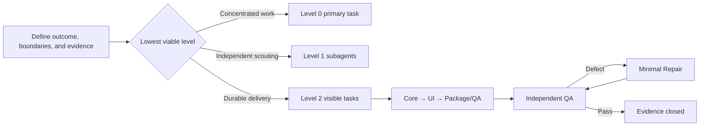

# Codex Multi-Session Orchestrator

[中文](README.md)

`orchestrate-codex-sessions-en` is a Codex Skill that chooses the smallest sufficient work units from first principles. It does not maximize agent count by default. It selects direct primary-task execution, in-thread subagent scouting, or visible independent tasks with durable delivery ownership.

Its goal is to give complex development explicit ownership, dependency order, independent QA, minimal Repair loops, and verifiable completion evidence.

## What it solves

- Distinguishes short-lived subagents from visible tasks that users can revisit, redirect, and resume.
- Prevents concurrent edits to overlapping scope in a shared checkout.
- Manages dependencies through Core → UI → Package/QA gates instead of starting everything at once.
- Keeps QA read-only, assigns fixes to separate Repair tasks, and returns results to the original QA task.
- Separates `PASS`, `DEFECT`, and `ENV BLOCK` instead of manufacturing green results.
- Joins user-visible outcomes, real data, builds, runtime, security, and unverified items into one evidence chain.

## Work-unit levels

| Level | Structure | Use when |
|---|---|---|
| Level 0 | Primary task completes the work directly | Scope is known and concentrated with one owner |
| Level 1 | Primary task plus in-thread subagents | Independent search, cross-file tracing, research, or verification adds value |
| Level 2 | Visible primary task plus visible delivery tasks and necessary subagents | Work crosses modules or time, needs stable ownership, user intervention, or independent QA |

Start at Level 0. Upgrade only when splitting work demonstrably reduces risk, context load, or elapsed time.



## When to use it

Use it for:

- multi-session, multi-agent, or project-orchestrator development;
- dependent Core, UI, packaging, release, and QA work;
- long-running handoffs, recovery, or direct user intervention in delivery tasks;
- independent QA, repair verification, and explicit completion evidence.

Do not use it implicitly for:

- a small change in a known file;
- a one-shot answer or simple explanation;
- work with no identifiable splitting benefit.

## Install

This repository provides two independently installable versions.

### English

Enter this in a new Codex task:

```text
Use $skill-installer to install:
https://github.com/ShadowwithEaGLE/orchestrate-codex-sessions/tree/main/skills/orchestrate-codex-sessions-en
```

### Chinese

```text
请用 $skill-installer 安装：
https://github.com/ShadowwithEaGLE/orchestrate-codex-sessions/tree/main/skills/orchestrate-codex-sessions
```

The installed Skill is available on the next turn.

## Use

Explicit English invocation:

```text
$orchestrate-codex-sessions-en Orchestrate implementation across Core, UI, Package, and independent QA.
```

Typical implicit triggers include `orchestrate implementation`, `orchestration complete`, `multi-session`, `project orchestrator`, and `independent QA`.

Explicit Chinese invocation:

```text
$orchestrate-codex-sessions 总管实施：拆分 Core、UI、Package 和独立 QA。
```

## Execution boundaries

- Create visible independent tasks only after explicit user authorization.
- Keep planning, comparison, and recommendation requests read-only.
- External writes, publishing, pushing, permission changes, and destructive actions require separate authorization.
- When task, subagent, wait, or worktree capabilities are unavailable, state the boundary and degrade safely.
- Serialize overlapping writes in a shared checkout. Parallel writes require non-overlapping ownership or separate worktrees.

## Repository layout

```text
skills/
├── orchestrate-codex-sessions/       # Chinese
│   ├── SKILL.md
│   ├── agents/openai.yaml
│   └── references/
└── orchestrate-codex-sessions-en/    # English
    ├── SKILL.md
    ├── agents/openai.yaml
    └── references/
```

Each version includes copy-ready templates for `AGENTS.md`, subagent scouting, visible implementation tasks, read-only QA, Repair, and primary-task gate reports.

## Validation

Both Skill directories are checked with the official Codex `skill-creator` validator and installed into clean temporary directories from their public GitHub URLs.

## License

This project is licensed under the [GNU General Public License v3.0 only](LICENSE), SPDX identifier `GPL-3.0-only`.
