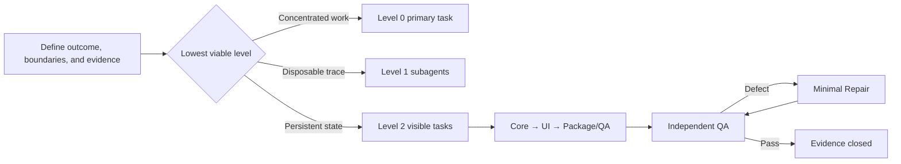

# Codex Multi-Session Orchestrator

[中文](README.md)

`orchestrate-codex-sessions-en` is a Codex Skill that asks whether the full execution trace is safely disposable. When it is, an in-thread subagent isolates temporary context; when identity, state, handoff, or user intervention must persist, the Skill creates a sidebar-visible task.

Its goal is to give complex development explicit ownership, dependency order, independent QA, minimal Repair loops, and verifiable completion evidence.

## What it solves

- Distinguishes short-lived subagents from visible tasks that users can revisit, redirect, and resume.
- Prevents concurrent edits to overlapping scope in a shared checkout.
- Manages dependencies through Core → UI → Package/QA gates instead of starting everything at once.
- Keeps QA read-only, assigns fixes to separate Repair tasks, and returns results to the original QA task.
- Separates `PASS`, `DEFECT`, and `ENV BLOCK` instead of manufacturing green results.
- Joins user-visible outcomes, real data, builds, runtime, security, and unverified items into one evidence chain.

## Work-unit levels

| Level | Structure | Use when |
|---|---|---|
| Level 0 | Primary task completes the work directly | Scope is known and concentrated with one owner |
| Level 1 | Primary task plus in-thread subagents | Finishes this turn, trace is disposable, and the primary task retains sole final ownership |
| Level 2 | Visible primary task plus visible delivery tasks and necessary subagents | Needs durable identity, independent ownership, formal handoff, recovery, or direct user entry |

Level 1 may perform read-only scouting, verification, or tightly bounded short-lived implementation; it is not a durable owner. Level 2 provides persistent state and user addressability, not automatic file isolation.



## When to use it

Use it for:

- multi-session, multi-agent, or project-orchestrator development;
- dependent Core, UI, packaging, release, and QA work;
- long-running handoffs, recovery, or direct user intervention in delivery tasks;
- independent QA, repair verification, and explicit completion evidence.

Do not use it implicitly for:

- a small change in a known file;
- a one-shot answer or simple explanation;
- work with no identifiable splitting benefit.

## Install

This repository provides two independently installable versions.

### English

Enter this in a new Codex task:

```text
Use $skill-installer to install:
https://github.com/ShadowwithEaGLE/orchestrate-codex-sessions/tree/main/skills/orchestrate-codex-sessions-en
```

### Chinese

```text
请用 $skill-installer 安装：
https://github.com/ShadowwithEaGLE/orchestrate-codex-sessions/tree/main/skills/orchestrate-codex-sessions
```

The installed Skill is available on the next turn.

## Use

Explicit English invocation:

```text
$orchestrate-codex-sessions-en Orchestrate implementation across Core, UI, Package, and independent QA.
```

Typical implicit triggers include `orchestrate implementation`, `orchestration complete`, `multi-session`, `project orchestrator`, and `independent QA`.

Explicit invocation with implementation intent authorizes the Skill to use Level 0/1 or create the Level 2 visible tasks its routing requires. Explicit invocation for planning, comparison, or review remains read-only. Implicit activation does not expand authority: when Level 2 is needed, the Skill first lists the proposed visible tasks and obtains one confirmation.

Explicit Chinese invocation:

```text
$orchestrate-codex-sessions 总管实施：拆分 Core、UI、Package 和独立 QA。
```

## Execution boundaries

- Level 1 must finish this turn, have a disposable trace, require no direct user entry, independent environment, or formal handoff, and be integrated and accepted by the primary task.
- Level 1 may use `spawn_agent`; an internal agent must never impersonate a work unit already classified as Level 2.
- When Level 1 discovers a need for durable state, it stops and promotes instead of silently becoming long-lived.
- After Level 2 creation, verify thread ID, title, project, environment, and status through the task list before claiming orchestration exists.
- If visible-task creation fails, stop and explain; do not downgrade to an internal subagent without approval.
- Keep planning, comparison, and recommendation requests read-only.
- External writes, publishing, pushing, permission changes, and destructive actions require separate authorization.
- When task, subagent, wait, or worktree capabilities are unavailable, state the boundary and degrade safely.
- Serialize overlapping writes in a shared checkout. Parallel writes require non-overlapping ownership or separate worktrees.

## Repository layout

```text
skills/
├── orchestrate-codex-sessions/       # Chinese
│   ├── SKILL.md
│   ├── agents/openai.yaml
│   └── references/
└── orchestrate-codex-sessions-en/    # English
    ├── SKILL.md
    ├── agents/openai.yaml
    └── references/
```

Each version includes copy-ready templates for `AGENTS.md`, subagent scouting, visible implementation tasks, read-only QA, Repair, and primary-task gate reports.

## Validation

Both Skill directories are checked with the official Codex `skill-creator` validator and installed into clean temporary directories from their public GitHub URLs.

## License

This project is licensed under the [GNU General Public License v3.0 only](LICENSE), SPDX identifier `GPL-3.0-only`.
