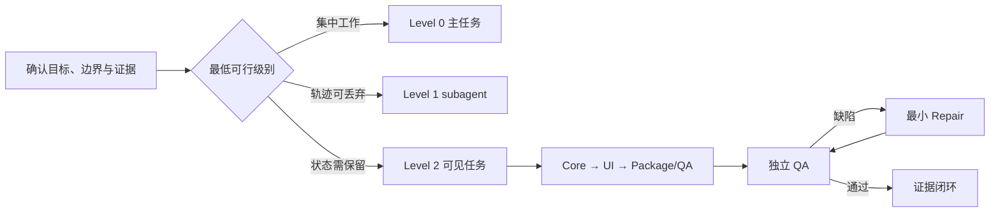

# Codex 多 Session 总管

[English](README.en.md)

`orchestrate-codex-sessions` 是一个 Codex Skill。它不默认追求更多 Agent，而是判断完整执行轨迹能否安全丢弃：能丢弃时使用会话内 subagent 隔离临时上下文；需要持久身份、状态、交接或用户介入时创建侧边栏可见任务。

核心目标是让复杂开发具备明确所有权、依赖顺序、独立 QA、最小 Repair 和可核验的完成证据。

## 它解决什么问题

- 区分短期 subagent 与可持续追问、恢复的可见任务。
- 防止共享 checkout 中多人同时修改同一范围。
- 用 Core → UI → Package/QA 闸门管理依赖，而不是同时开工后再合并冲突。
- 保持 QA 只读，把修复交给独立 Repair，再回原 QA 复验。
- 区分 `PASS`、`DEFECT` 和 `ENV BLOCK`，不制造假绿。
- 把用户可见结果、真实数据、构建、运行、安全和未验证项纳入同一证据链。

## 工作单元

| 级别 | 结构 | 适用场景 |
|---|---|---|
| Level 0 | 主任务直接完成 | 已知范围、小改动、单一责任主体 |
| Level 1 | 主任务 + 会话内 subagent | 可在本轮完成，过程可丢弃，主任务保持唯一最终所有权 |
| Level 2 | 可见主任务 + 可见交付任务 + 必要 subagent | 需要持久身份、独立所有权、正式交接、恢复或用户直接进入 |

Level 1 可以做只读侦察、验证或边界明确的短期实施；它不是长期责任主体。Level 2 解决持久状态和用户可寻址性，但不自动提供文件隔离。



## 何时使用

适合：

- 多 Session、多 Agent 或项目总管开发；
- Core、UI、打包、发布和 QA 存在依赖；
- 需要长期任务交接、恢复或用户直接进入任务纠偏；
- 需要独立 QA、返工闭环和明确完成证据。

不适合：

- 已知文件中的单一小改；
- 一次性回答或简单解释；
- 无法说明拆分收益的任务。

## 安装

仓库提供两个可独立安装的版本。

### 中文版

在 Codex 新任务中输入：

```text
请用 $skill-installer 安装：
https://github.com/ShadowwithEaGLE/orchestrate-codex-sessions/tree/main/skills/orchestrate-codex-sessions
```

### English version

```text
Use $skill-installer to install:
https://github.com/ShadowwithEaGLE/orchestrate-codex-sessions/tree/main/skills/orchestrate-codex-sessions-en
```

安装完成后，下一轮任务即可使用。

## 使用

中文版显式调用：

```text
$orchestrate-codex-sessions 总管实施：拆分 Core、UI、Package 和独立 QA。
```

常见隐式触发词：`总管实施`、`编排完成`、`多 Session`、`项目总管`、`独立 QA`。

显式调用本 Skill 并要求实施，表示授权它按判定结果使用 Level 0/1 或创建必要的 Level 2 可见任务。显式调用但只要求计划、比较或审查时仍保持只读。Skill 仅被隐式触发时不会自动扩大授权：若需要 Level 2，会先列出拟创建任务并取得一次确认。

英文版显式调用：

```text
$orchestrate-codex-sessions-en Orchestrate implementation across Core, UI, Package, and independent QA.
```

## 执行边界

- Level 1 必须满足：本轮完成、轨迹可丢弃、无需用户直接进入、无需独立环境或正式交接，并由主任务整合验收。
- Level 1 可使用 `spawn_agent`；不得用内部 agent 冒充已经判定为 Level 2 的可见任务。
- Level 1 发现需要持久状态时必须停止并升级，不能静默演变成长任务。
- Level 2 创建后必须通过任务列表核对 thread ID、标题、项目、环境和状态，未确认前不得声称编排已建立。
- 可见任务创建失败时停止说明，未经同意不得降级成内部 subagent。
- 计划、比较或建议请求保持只读，不擅自实施。
- 外部写入、发布、推送、权限变更和破坏性操作仍需单独授权。
- 缺少 task、subagent、wait 或 worktree 能力时，技能会说明边界并降级执行。
- 共享 checkout 中的重叠写入必须串行；真正并行写入需要不重叠所有权或独立 worktree。

## 仓库结构

```text
skills/
├── orchestrate-codex-sessions/       # 中文版
│   ├── SKILL.md
│   ├── agents/openai.yaml
│   └── references/
└── orchestrate-codex-sessions-en/    # English version
    ├── SKILL.md
    ├── agents/openai.yaml
    └── references/
```

每个版本都包含可直接复制的 `AGENTS.md`、subagent、可见实现任务、只读 QA、Repair 和阶段闸门模板。

## 验证

两个技能目录均使用 Codex 官方 `skill-creator` 校验器检查，并通过 GitHub 公网 URL 做干净目录安装测试。

## License

本项目采用 [GNU General Public License v3.0 only](LICENSE)，SPDX 标识为 `GPL-3.0-only`。
